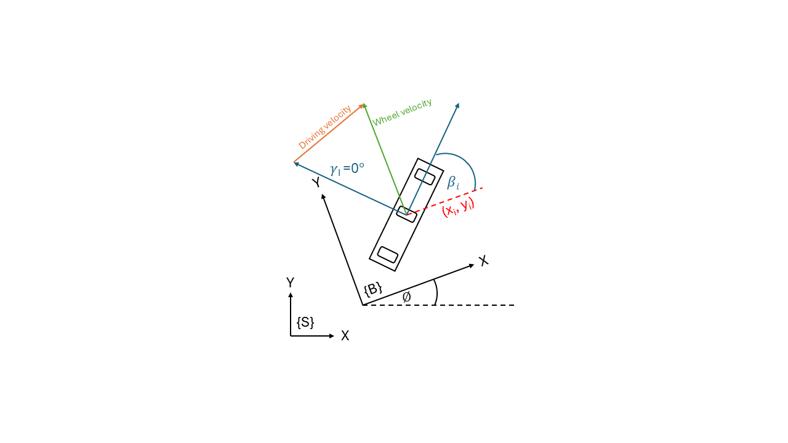
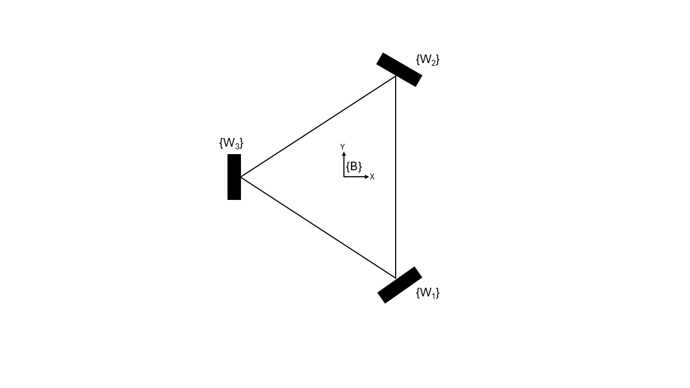

# omni-carver

https://github.com/user-attachments/assets/3435d6dd-67d6-426c-801f-3730e0f8ce20

<!-- TABLE OF CONTENTS -->
# Table of Contents
<ol>
    <li>
        <a href="#about-the-project">About The Project</a>
        <ul>
            <li><a href="#system-architecture">System Architecture</a></li>
        </ul>
    </li>
    <li>
        <a href="#robot-setup">Robot setup</a>
        <ul>
        <li><a href="#prerequisites">Prerequisites</a></li>
            <ul>
                <li><a href="#python-packages">Python packages</a></li>
                <li><a href="#ros2-packages">ROS2 packages</a></li>
            </ul>
        <li><a href="#installation">Installation</a></li>
        </ul>
    </li>
    <li><a href="#contributors">Contributors</a></li>
</ol>

# About The Project

This project is the part of open-topic research of FRA361 class that focus about how to getting map with actual robot by create new firmware of robot to using slam toolbox for mapping.

# Hardware

## 1. 3 omni-wheels mobile robot.

## 2. Laser Sensor

- [LiDAR LD06](https://th.rs-online.com/web/p/sensor-development-tools/2037609)

## 3. IMU

- [BNO055 USB stick](https://www.digikey.co.th/th/products/detail/bosch-sensortec/BNO055-USB-STICK/6136288?srsltid=AfmBOopQXxThDLAN2mAPddHxnJptcNuUyhAxiubvHIMDygA-2x8FSyLa)

## 4. Microcontroller

- [ESP32 Wroom 32](https://www.arduitronics.com/product/5007/%E0%B8%9A%E0%B8%AD%E0%B8%A3%E0%B9%8C%E0%B8%94-esp-32-nodemcu-esp-wroom-32-wi-fi-and-bluetooth-dual-core-ch9102x-30-pin)

## 5. Processor

- Intel NUC

# Firmware setup(ESP32 Firmware)

ESP32 is the microcontroller for our robot's low level control that have a PID controller for each motor to control the motor to reach velocity setpoint.

> [!NOTE]
> You can find the ESP32 firmware via this <a href="src/esp32_firmware/esp32/">link</a>. Additionally, I connect ESP32 and NUC by using <a href="https://github.com/pyserial/pyserial">pyserial</a>.

# Software setup(ROS2)

For this robot I use <a href="https://docs.ros.org/en/jazzy/index.html">ROS2 Jazzy</a> to be our middleware to build this robot. And to use this robot to do this task I have to create some new nodes for make this robot can teleop with [teleop_twist_keyboard](https://github.com/ros-teleop/teleop_twist_keyboard), then do mapping with slam toolbox.

> [!WARNING]
> For everything that explain below, you need to install dependencies that tell in that section if you want to use
> this robot.

## 1. Arduino serial node

See in <a href="src/omni_carver_arduino_serial/scripts/arduino_serial_node_script.py">arduino_serial_node_script.py</a>. This node has task to stream joint states data and send joint velocity command from/to ESP32.

> [!WARNING]
> To use this node make sure you install bno055_usb_stick_py, you can simply install it via this command:
> `python -m pip install pyserial`

## 2. BNO055 USB stick node

See in <a href="src/bno055_usb_stick/scripts/bno055_usb_stick_node_script.py">bno055_usb_stick_node</a>. This node has task to stream imu's data from BNO055 USB stick via [bno055_usb_stick_py](https://github.com/selyunin/bno055_usb_stick_py).

> [!WARNING]
> To use this node make sure you install bno055_usb_stick_py, you can simply install it via this command:
> `pip install bno055-usb-stick-py`

## 3. ldlidar_stl_ros2

This package is from LDROBOT who is develop a LD06 lidar. To use LD06, I use this package to communicate between ROS2 and LD06. You can find original github [here](https://github.com/rudislabs/ldlidar_stl_ros2/tree/pr-binning).

> [!CAUTION]
> To use with slam toolbox, make sure you clone this package from `pr-binning` branch(Same as upper link). And setting up parameter like this [file](src/ldlidar_stl_ros2/launch/ld06.launch.py) to make it compatible with slam toolbox.

## 4. omni_drive_node

See in <a href="src/omni_carver_controller/scripts/omni_drive_node_script.py">omni_drive_node_script.py</a>. This node is implement kinematics model of 3 omni-wheels mobile robot to calculate twist at base frame of robot to wheel velocity at wheel frame call inverse kinematics and calculate wheel odometry of robot via forward kinematics.

### Omnidirectional robot kinematics

$$
u_i = \frac{1}{r_i}
\begin{bmatrix}
1 & \tan\gamma_i
\end{bmatrix}
\begin{bmatrix}
\cos\beta_i & \sin\beta_i \\
-\sin\beta_i & \cos\beta_i
\end{bmatrix}
\begin{bmatrix}
-y_i & 1 & 0 \\
x_i & 0 & 1
\end{bmatrix}
V_b
$$

where:
- $ u_i $: velocity of the wheel $ i $
- $ r_i $: radius of the wheel $ i $
- $ \gamma_i $: wheel orientation angle (caster angle)
- $ \beta_i $: wheel mounting angle relative to robot base
- $ (x_i, y_i) $: coordinates of wheel $ i $ relative to robot center
- $ V_b $: robot velocity vector in body frame

### Inverse kinematics

$$
\begin{bmatrix}
u_1 \\[6pt]
u_2 \\[6pt]
u_3
\end{bmatrix}
=
\frac{1}{r}
\begin{bmatrix}
-d & -\frac{\sqrt{3}}{2} &  -\frac{1}{2} \\[6pt]
-d & \frac{\sqrt{3}}{2} & -\frac{1}{2} \\[6pt]
-d & 0 & 1
\end{bmatrix}
\begin{bmatrix}
\omega_{bz} \\[6pt]
v_{bx} \\[6pt]
v_{by}
\end{bmatrix}
$$

where:
- $ u_1, u_2, u_3 $: Velocities of the wheels
- $ r $: Wheel radius
- $ d $: Distance from the center of the robot to each wheel
- $ \omega_{bz} $: Angular velocity around the Z-axis (yaw rate)
- $ v_{bx} $: Linear velocity along the X-axis
- $ v_{by} $: Linear velocity along the Y-axis

### Forward kinematics

Because of inverse kinematics equation can be inverse matrix. So forward kinematics will do psedo-inverse of inverse kinematics.

$$
\begin{bmatrix}
\vec{\omega}_{bz} \\[6pt]
\vec{v}_{bx} \\[6pt]
\vec{v}_{by}
\end{bmatrix}
=
H^{+} \vec{u}
$$

where:
- $ \vec{\omega}_{bz} $: Robot angular velocity around the Z-axis
- $ \vec{v}_{bx} $: Robot linear velocity along the X-axis
- $ \vec{v}_{by} $: Robot linear velocity along the Y-axis
- $ H^{+} $: Pseudoinverse of the kinematic transformation matrix $H$
- $ \vec{u} $: Vector of wheel velocities

## 5. omni_carver_description

See in <a href="src/omni_carver_description/launch/description.launch.py">description.launch.py</a>. This package is for create transformation of robot via URDF file to visualize by rviz2 and calculate some data.

## 6. omni_carver_localization

See in <a href="src/omni_carver_localization/launch/ekf.launch.py">ekf.launch.py</a>. This package has contain launch file for EKF from robot localization package to filt wheel odometry and imu togeter to make odometry of robot more smooth and accurate. For robot localization config, I use this guide to custom my config.

> !WARNING
> At this moment robot have a lot of error form sensor such as IMU or wheel encoder. So it need to tune more to make odometry more accurate. Additionally, to use this launch file you need to install robot localization package via this command: `sudo apt install ros-jazzy-robot-localization`

## 7. omni_carver_slam

See in <a href="src/omni_carver_slam/launch/mapping.launch.py">mapping.launch.py</a>. This pacakge has contain launch file for mapping and save map via slam toolbox and nav2.

> !WARNING
> To use this launch file you need to install slam toolbox and nav2 via this command:
`sudo apt install ros-jazzy-slam-toolbox`, `sudo apt install ros-jazzy-navigation2`, and `sudo apt install ros-jazzy-nav2-bringup`

> !TIP
> To launch all launch files that make robot can do mapping run this command `ros2 launch omni_carver_bringup omni_carver_bringup.launch.py`. This launch file will bringup every important launch file for this robot.

# Mapping

After launch `omni_carver_bringup`, you can also launch `ros2 launch omni_carver_slam mapping.launch.py`. It will show up rviz2 window that already presetting for do mapping via slam toolbox. After finish mapping, you can launch
`ros2 launch omni_carver_slam save_map.launch.py` to save map.

> !TIP
> To do mapping, I recommend you to move slowly for more accurate map. And after save map, map will appear at home directory.

# Demonstrate

https://github.com/user-attachments/assets/e033a0e5-0f04-4321-bec6-3be6cb211be1

# Issues

1. Old robot stucture has some problem that effected to imu and wheel odometry.
2. Swing imu data, from first issue that effected direct to imu make imu data lose accuracy.
3. Lidar has found some part of robot that make map creation error.
4. Wheel PID tuning is not good, make robot can't reach the setpoint.
5. Robot jerks when it starts walking and stops walking.

# Contributors
- Nakarin Jettanatummajit (65340500033)
