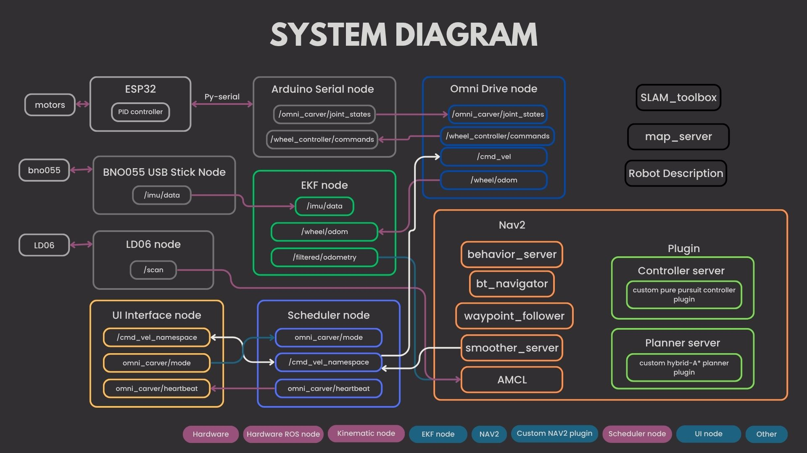
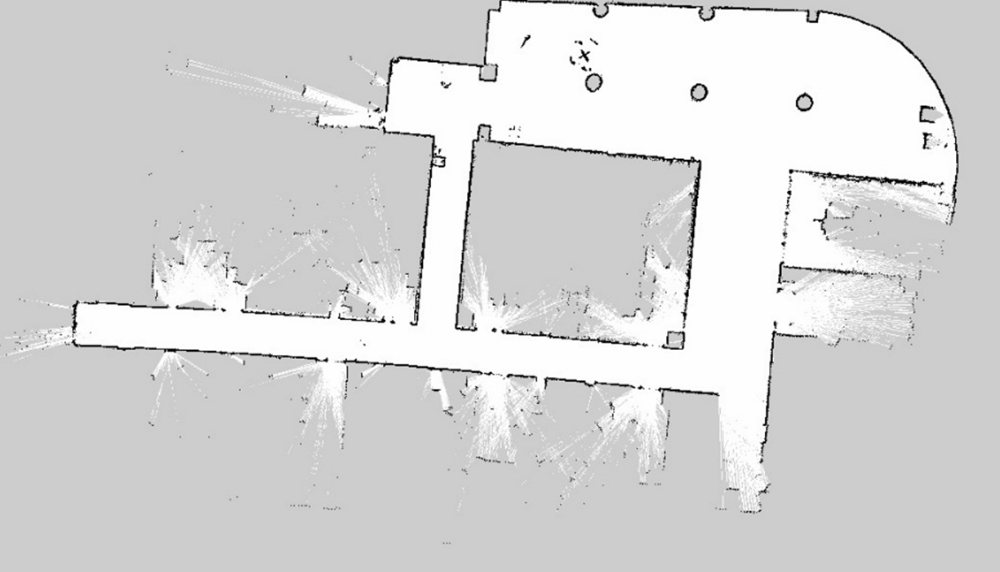
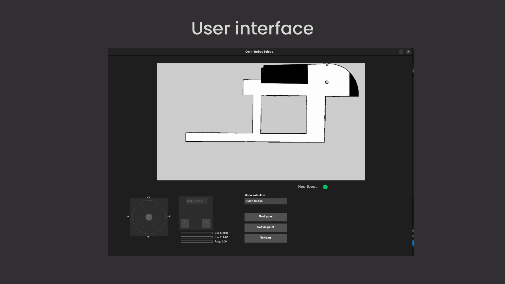

# omni-carver

https://github.com/user-attachments/assets/ef4664e7-ccda-4c08-aa3f-8ea90e89929b

<!-- TABLE OF CONTENTS -->
# Table of Contents
<ol>
    <li>
        <a href="#about-the-project">About The Project</a>
    </li>
    <li>
        <a href="#system-diagram">System diagram</a>
    </li>
    <li>
        <a href="#using">Using</a>
    </li>
    <li>
        <a href="#hardware">Hardware</a>
    </li>
    <li>
        <a href="#firmware-setupesp32-firmware">Firmware setup</a>
    </li>
    <li>
        <a href="#software-setupros2">Software setup</a>
    </li>
    <li>
        <a href="#mapping">Mapping</a>
    </li>
    <li>
        <a href="#pure-pursuit-controller">Pure pursuit controller</a>
    </li>
    <li>
        <a href="#hybrid-a-star-planner">Hybrid A-star planner</a>
    </li>
    <li>
        <a href="#navigation">Navigation</a>
    </li>
    <li>
        <a href="#omni-carver-user-interface">Omni-carver user interface</a>
    </li>    
    <li>
        <a href="#further-improvement">Further improvement</a>
    </li>
    <li>
        <a href="#contributors">Contributors</a>
    </li>
</ol>

# About The Project

This project is the part of open-topic research of FRA361 and mobile robotics of FRA532 that focus about how to build the mobile robot based on 3 omni-wheels platform.

# System diagram

<p align="center"></p>

# Using

To run this project you need to plug all sensor into NUC and ESP32 too(Plug EPS32 first). Next is run this command:

```
ros2 launch omni_carver_bringup omni_carver_autonomous_bringup.launch.py
```

> [!WARN]
> When build this project you need to skip omni_carver_mpc_controller package because it has bug via this command `colcon build --package-skip omni_carver_mpc_controller`

After run this command you will see the RVIZ2 window show on the display.

Next run this command to open UI:

```
ros2 run omni_user_interface omni_user_interface.py
```

# Hardware

## 1. 3 omni-wheels mobile robot.

<p align="center"></p>

## 2. Laser Sensor

- [LiDAR LD06](https://th.rs-online.com/web/p/sensor-development-tools/2037609)

## 3. IMU

- [BNO055 USB stick](https://www.digikey.co.th/th/products/detail/bosch-sensortec/BNO055-USB-STICK/6136288?srsltid=AfmBOopQXxThDLAN2mAPddHxnJptcNuUyhAxiubvHIMDygA-2x8FSyLa)

## 4. Microcontroller

- [ESP32 Wroom 32](https://www.arduitronics.com/product/5007/%E0%B8%9A%E0%B8%AD%E0%B8%A3%E0%B9%8C%E0%B8%94-esp-32-nodemcu-esp-wroom-32-wi-fi-and-bluetooth-dual-core-ch9102x-30-pin)

## 5. Processor

- Intel NUC

> [!NOTE]
> NUC's password is 123456

# Firmware setup(ESP32 Firmware)

ESP32 is the microcontroller for our robot's low level control that have a PID controller for each motor to control the motor to reach velocity setpoint.

> [!NOTE]
> You can find the ESP32 firmware via this <a href="src/esp32_firmware/esp32/">link</a>. Additionally, I connect ESP32 and NUC by using <a href="https://github.com/pyserial/pyserial">pyserial</a>.

# Software setup(ROS2)

For this robot I use <a href="https://docs.ros.org/en/jazzy/index.html">ROS2 Jazzy</a> to be our middleware to build this robot. And to use this robot to do this task I have to create some new nodes for make this robot can teleop with [teleop_twist_keyboard](https://github.com/ros-teleop/teleop_twist_keyboard), then do mapping with slam toolbox.

> [!WARNING]
> For everything that explain below, you need to install dependencies that tell in that section if you want to use
> this robot.

## 1. Arduino serial node

See in <a href="src/omni_carver_arduino_serial/scripts/arduino_serial_node_script.py">arduino_serial_node_script.py</a>. This node has task to stream joint states data and send joint velocity command from/to ESP32.

> [!WARNING]
> To use this node make sure you install bno055_usb_stick_py, you can simply install it via this command:
> `python -m pip install pyserial`

## 2. BNO055 USB stick node

See in <a href="src/bno055_usb_stick/scripts/bno055_usb_stick_node_script.py">bno055_usb_stick_node</a>. This node has task to stream imu's data from BNO055 USB stick via [bno055_usb_stick_py](https://github.com/selyunin/bno055_usb_stick_py).

> [!WARNING]
> To use this node make sure you install bno055_usb_stick_py, you can simply install it via this command:
> `pip install bno055-usb-stick-py`

## 3. ldlidar_stl_ros2

This package is from LDROBOT who is develop a LD06 lidar. To use LD06, I use this package to communicate between ROS2 and LD06. You can find original github [here](https://github.com/rudislabs/ldlidar_stl_ros2/tree/pr-binning).

> [!CAUTION]
> To use with slam toolbox, make sure you clone this package from `pr-binning` branch(Same as upper link). And setting up parameter like this [file](src/ldlidar_stl_ros2/launch/ld06.launch.py) to make it compatible with slam toolbox.

## 4. omni_drive_node

See in <a href="src/omni_carver_controller/scripts/omni_drive_node_script.py">omni_drive_node_script.py</a>. This node is implement kinematics model of 3 omni-wheels mobile robot to calculate twist at base frame of robot to wheel velocity at wheel frame call inverse kinematics and calculate wheel odometry of robot via forward kinematics.

### Omnidirectional robot kinematics

<p align="center"></p>

$$
u_i = \frac{1}{r_i}
\begin{bmatrix}
1 & \tan\gamma_i
\end{bmatrix}
\begin{bmatrix}
\cos\beta_i & \sin\beta_i \\
-\sin\beta_i & \cos\beta_i
\end{bmatrix}
\begin{bmatrix}
-y_i & 1 & 0 \\
x_i & 0 & 1
\end{bmatrix}
V_b
$$

where:
- $u_i$: velocity of the wheel $i$
- $r_i$: radius of the wheel $i$
- $\gamma_i$: wheel orientation angle (caster angle)
- $\beta_i$: wheel mounting angle relative to robot base
- $(x_i, y_i)$: coordinates of wheel $i$ relative to robot center
- $V_b$: robot velocity vector in body frame

### Inverse kinematics

<p align="center"></p>

```math
\begin{bmatrix}
u_1 \\
u_2 \\
u_3
\end{bmatrix}
=
\frac{1}{r}
\begin{bmatrix}
-d & -\frac{\sqrt{3}}{2} &  -\frac{1}{2} \\
-d & \frac{\sqrt{3}}{2} & -\frac{1}{2} \\
-d & 0 & 1
\end{bmatrix}
\begin{bmatrix}
\omega_{bz} \\
v_{bx} \\
v_{by}
\end{bmatrix}
```

where:
- $u_1$, $u_2$, $u_3$: Velocities of the wheels
- $r$: Wheel radius
- $d$: Distance from the center of the robot to each wheel
- $\omega_{bz}$: Angular velocity around the Z-axis (yaw rate)
- $v_{bx}$: Linear velocity along the X-axis
- $v_{by}$: Linear velocity along the Y-axis

### Forward kinematics

Because of inverse kinematics equation can be inverse matrix. So forward kinematics will do psedo-inverse of inverse kinematics.

```math
\begin{bmatrix}
\vec{\omega}_{bz} \\\
\vec{v}_{bx} \\\
\vec{v}_{by}
\end{bmatrix}
=
H^{+} \vec{u}
```

where:
- $\vec{\omega}_{bz}$: Robot angular velocity around the Z-axis
- $\vec{v}_{bx}$: Robot linear velocity along the X-axis
- $\vec{v}_{by}$: Robot linear velocity along the Y-axis
- $H^{+}$: Pseudoinverse of the kinematic transformation matrix $H$
- $\vec{u}$: Vector of wheel velocities

## 5. omni_carver_description

See in <a href="src/omni_carver_description/launch/description.launch.py">description.launch.py</a>. This package is for create transformation of robot via URDF file to visualize by rviz2 and calculate some data.

## 6. omni_carver_localization

See in <a href="src/omni_carver_localization/launch/ekf.launch.py">ekf.launch.py</a>. This package has contain launch file for EKF from robot localization package to filt wheel odometry and imu togeter to make odometry of robot more smooth and accurate. For robot localization config, I use this guide to custom my config.

> [!WARNING]
> At this moment robot have a lot of error form sensor such as IMU or wheel encoder. So it need to tune more to make odometry more accurate. Additionally, to use this launch file you need to install robot localization package via this command: `sudo apt install ros-jazzy-robot-localization`

## 7. omni_carver_slam

See in <a href="src/omni_carver_slam/launch/mapping.launch.py">mapping.launch.py</a>. This pacakge has contain launch file for mapping and save map via slam toolbox and nav2.

> [!WARNING]
> To use this launch file you need to install slam toolbox and nav2 via this command:
`sudo apt install ros-jazzy-slam-toolbox`, `sudo apt install ros-jazzy-navigation2`, and `sudo apt install ros-jazzy-nav2-bringup`

> [!TIP]
> To launch all launch files that make robot can do mapping run this command `ros2 launch omni_carver_bringup omni_carver_bringup.launch.py`. This launch file will bringup every important launch file for this robot.

## 8. omni_carver_nav2

See in <a href="src/omni_carver_nav2/launch/bringup_launch.py">bringup_launch.py</a>. This package has contain custom launch file for nav2. They have amcl, bt, and other package for navigate the robot.

> [!WARNING]
> To use this launch file you need to install nav2 via this command:
`sudo apt install ros-jazzy-navigation2`, and `sudo apt install ros-jazzy-nav2-bringup`

> [!TIP]
> To launch all launch files that make robot can navigate run this command `ros2 launch omni_carver_bringup omni_carver_bringup.launch.py`. This launch file will bringup every important launch file for this robot.

## 9. omni_carver_scheduler

See in <a href="src/omni_carver_scheduler/scripts/scheduler_node_script.py">scheduler_node_script.py</a>. This package will manage the mode of robot that have difference velocity command topic. So this package will select actual velocity source to move the robot.

## 10. omni_carver_pure_pursuit

See in <a href="src/omni_carver_pure_pursuit/src/omni_carver_pure_pursuit.cpp">omni_carver_pure_pursuit.cpp</a>. This package is coding based on nav2 plugin that contain importance function to make this robot can use this controller via nav2 stack.

## 11. omni_carver_pure_pursuit

See in <a href="src/hybrid_astar_planner/src/hybrid_astar_planner.cpp">hybrid_astar_planner.cpp</a>. This package is coding based on nav2 plugin that contain importance function to make this robot can use planner via nav2 stack.

# Mapping

After launch `omni_carver_bringup`, you can also launch `ros2 launch omni_carver_slam mapping.launch.py`. It will show up rviz2 window that already presetting for do mapping via slam toolbox. After finish mapping, you can launch
`ros2 launch omni_carver_slam save_map.launch.py` to save map.

> [!TIP]
> To do mapping, I recommend you to move slowly for more accurate map. And after save map, map will appear at home directory.


<p align="center"></p>

# Pure pursuit controller

This controller has build based on <a href="https://docs.nav2.org/plugin_tutorials/docs/writing_new_nav2controller_plugin.html">NAV2 tutorial</a> and Mobile robotics class.

# Hybrid A-star planner

Hybrid A* is an extension of the classical A* search that operates in a continuous, non-holonomic state space:

$$\mathcal{S} = \{(x, y, \theta)\}$$

by expanding along kinematically feasible motion primitives. Periodically, an analytic connection (e.g., Reeds–Shepp or Dubins) is attempted to the goal to improve smoothness and near-optimality.

## Governing Equations

### 1. State update (motion primitive)

A primitive of length $L$ and steering angle $\delta$ induces:

$$R(\delta) = \frac{L_{\mathrm{wb}}}{\tan\delta}, \quad \Delta\theta = \frac{L}{R(\delta)}$$

$$\theta' = \theta + \Delta\theta, \quad x' = x + L \cos\Bigl(\theta + \tfrac{\Delta\theta}{2}\Bigr), \quad y' = y + L \sin\Bigl(\theta + \tfrac{\Delta\theta}{2}\Bigr)$$

where $L_{\mathrm{wb}}$ is the vehicle wheelbase.

### 2. Cost function

The incremental cost of moving from state $s_i$ to $s_j$ is:

$$c(s_i, s_j) = w_{\mathrm{length}}\,L \;+\; w_{\mathrm{penalty}}\,P(s_i, s_j)$$

where $P(\cdot)$ penalizes undesirable maneuvers (e.g., reversing or sharp turns). The total cost-to-come is:

$g(s_j) = g(s_i) + c(s_i, s_j)$

### 3. Heuristic

An admissible heuristic combines Euclidean and non-holonomic estimates:

$$h_{\mathrm{Euc}}(s) = \sqrt{(x - x_g)^2 + (y - y_g)^2}, \quad h(s) = \max\{\,h_{\mathrm{Euc}}(s),\,h_{\mathrm{RS}}(s)\}$$

where $h_{\mathrm{RS}}$ is the Reeds–Shepp distance between $(x,y,\theta)$ and the goal $(x_g,y_g,\theta_g)$.

## Parameters

| Parameter                    | Symbol                        | Description                                                    | Typical Value           |
|------------------------------|-------------------------------|----------------------------------------------------------------|-------------------------|
| Primitive length             | $L$                         | Distance per expansion step                                    | 0.5 m                  |
| Steering discretization      | $\{\delta_k\}$              | Set of allowed steering angles                                 | $\{-0.3,0,+0.3\}$ rad |
| Analytic-expansion frequency | $N_{\mathrm{AE}}$           | Attempt analytic connect every $N_{\mathrm{AE}}$ expansions  | 20                      |
| Cost weight (length)         | $w_{\mathrm{length}}$       | Multiplier on $L$                                            | user-tunable            |
| Cost weight (penalty)        | $w_{\mathrm{penalty}}$      | Multiplier on motion penalties (reverse, curvature, etc.)      | user-tunable            |
| Goal tolerance (position)    | $\epsilon_{xy}$             | Distance threshold to trigger analytic expansion               | 0.5 m                   |
| Goal tolerance (heading)     | $\epsilon_{\theta}$         | Heading threshold to accept goal                               | 5°                      |
| Wheelbase                    | $L_{\mathrm{wb}}$           | Vehicle wheelbase used in turning radius calculation           | e.g., 2.5 m             |

> [!TIP]
> *Tuning these parameters trades off planning speed, path smoothness, and optimality.*

## References

1. Dolgov, D., Thrun, S., Montemerlo, M., & Diebel, J. (2008). *Path Planning for Autonomous Vehicles in Unknown Semi-structured Environments*. International Journal of Robotics Research.

2. Pivtoraiko, M., Knepper, R. A., & Kelly, A. (2009). *Differentially Constrained Mobile Robot Motion Planning in State Lattices*. Journal of Field Robotics.

3. Pivtoraiko, M., & Kelly, A. (2011). *Efficient Search-Based Kinodynamic Planning*. IEEE International Conference on Robotics and Automation.

# Omni-carver user interface

This Python/ROS2 application provides a single, unified GUI—built with **pygame**—for both **manual teleoperation** and **Nav2-based autonomous navigation** of an omni-directional robot. From a top-down map view you can:

- Switch between **Teleoperation** and **Autonomous** modes
- In Teleop, drive the robot via a draggable on-screen joystick and angular controls
- In Autonomous, define a 2D "goal pose" or multiple "via points" (each with position + heading) directly by click-and-drag on the map, then send them to Nav2
- See live AMCL localization, teleop/autonomous velocity feedback, and a heartbeat indicator for system health

## Key Functionalities

### 1. Mode Selection
- Initial placeholder "Choose…", then pick **Teleoperation** or **Autonomous**
- Automatically calls `omni_carver/mode` service on changes

### 2. Teleoperation
- **Joystick**: click & drag inside a circular widget → smooth `<Twist>` on `/cmd_vel_teleop`
- **Rotation controls**: ←/→ buttons plus "Max ω" dropdown
- **Gauges**: real-time Lin X, Lin Y, Ang readings (from teleop or `/cmd_vel` feedback)

### 3. Autonomous Navigation

#### Goal Pose
1. Click "Goal pose" → clears previous markers
2. Click & **hold-drag** on map: defines `(x,y,yaw)` by drag direction
3. Release → sends a `NavigateToPose` action goal
4. Draws final red circle + arrow showing target orientation

#### Via-Points
1. Click "Set via point" → click-drag to define each waypoint's `(x,y,yaw)`
2. Accumulates blue numbered markers with orientation arrows
3. "Navigate" button → sequentially sends each waypoint to Nav2

#### Clear-on-New
Selecting a new goal or via resets existing markers

### 4. Map & Localization
- Loads PGM map + `resolution`/`origin` from `map.yaml`
- Subscribes to `/amcl_pose` and draws a green circle + heading line at the robot's current estimate

### 5. Heartbeat Indicator
- Subscribes to Empty messages on `omni_carver/heartbeat`
- If no heartbeat for > 7 s → shows **red**; otherwise **green**

### 6. Non-Blocking UI Loop
- Combines `pygame` event loop with `rclpy.spin_once(...)` and frame‐rate limiting (`clock.tick(60)`)
- Ensures smooth rendering, responsive input, and live ROS callbacks

<p align="center"></p>

# Demonstrate

https://github.com/user-attachments/assets/811c1a70-ac64-4048-8df0-57d52a2908b2

https://github.com/user-attachments/assets/c5343f66-4aa2-45ce-a17f-9282ac09b9c5

https://github.com/user-attachments/assets/d23895d3-7205-43cc-9bc3-8330406a1674

> [!NOTE]
> All demonstrate video has speed up(x2).

# Further improvement

1. Tuning PID controller in low-level control(ESP32).
2. Change pwm's frequency that drive motor.
3. Create new map for other floor at FIBO.
4. Tuning EKF to make robot odometry more accurate.
5. Tuning AMCL to make robot localize more accurate.
6. Coding global planner to add some function that relate to nav2 plugin.
7. Coding new local planner such as MPC controller, LQR controller or etc, based on nav2 plugin to make robot can avoid obstacles using local cost map data.
8. Coding Behavior tree plugin based on nav2 plugin to control robot's behavior such as regenerate new path if robot stuck at corner.
9. Coding anouther plugin of nav2.
10. Make this robot can navigate multi-floor.

# Contributors
- Nakarin Jettanatummajit (65340500033)
- Karanyaphas Chitsuebsai (65340500065)
